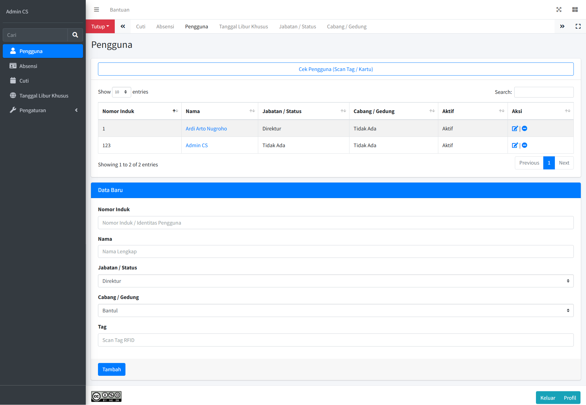

*Tampilan Dashboard*

Nama Database: absensis
absensi
(File impor: db/absensi.sql)

Login Default:
Nomor Induk: 123
Password: admin
Catatan Konfigurasi:
Pastikan untuk menyesuaikan pengaturan koneksi basis data di file berikut:

etc/config.php - Ubah variabel $databaseName menjadi nama database yang sudah dibuat.
machine.php - Sesuaikan koneksi basis data untuk absensi dari mesin.
